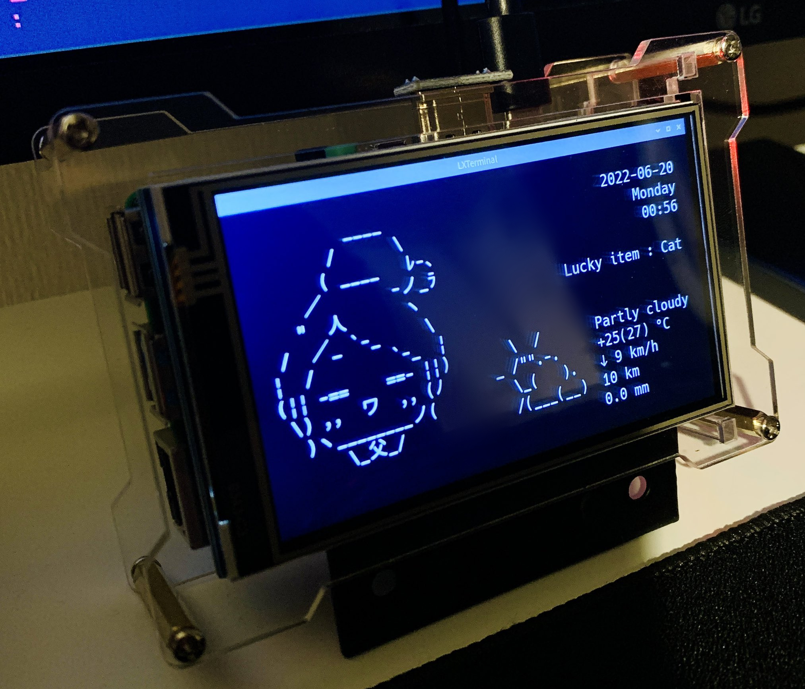

<!-- omit in toc -->
# Moda Clock



## 1. 概要

CUI で動作するもだねちゃんの時計です🌸

- 現在の日時を常時表示します。
- もだねちゃんの表情がコロコロ変わります。
- 環境変数で指定した場所の天気を30分毎に取得して表示します。
- シェルのウィンドウ幅に応じてレスポンシブに描画します。
- and more...

## 2. 動作環境

Linux に準じた環境かつ C 言語のコンパイル・実行ができる環境であれば動くと思います。  
動作検証は下記で行っています。

- Raspberry Pi OS
- WSL2 Ubuntu

## 3. 環境構築

```shell
> git clone https://github.com/kenkenpa198/ModaClock.git # クローン
> export WTTR_LOCALE="Tokyo"                             # 天気表示用のロケール設定。.bashrc などに記述して永続化しておいた方がよいです
> sudo apt install libncurses5-dev                       # curses ライブラリのインストール
> gcc ModaClock.c -lncursesw -o ModaClock.out            # コンパイル
> ./ModaClock.out                                        # 実行
```

## 4. クレジット

以下のソフト等を利用させていただいております。

- [chubin/wttr.in: The right way to check the weather](https://github.com/chubin/wttr.in)

## 5. 参考サイト

### 5.1. 画面描画

- [curses による端末制御](https://www.kushiro-ct.ac.jp/yanagawa/ex-2017/2-game/01.html)
- [cursesライブラリの超てきとー解説](https://www.kushiro-ct.ac.jp/yanagawa/pl2b-2018/curses/about.html)
- [[linux] cursesライブラリのインストール --- undefined reference 'initscr'|Debugging as Usual](http://debuggingasusual.blogspot.com/2011/12/curses.html)
- [C言語でシンプルすぎるブロック崩しを書いた - Qiita](https://qiita.com/pokohide/items/a246045f3ccaf540a375)
- [文字列の長さの取得(C言語) - 超初心者向けプログラミング入門](https://programming.pc-note.net/c/mojiretsu2.html)

### 5.2. 時計

- [C言語ケーススタディ　時計の作り方1](http://www.orchid.co.jp/computer/cschool/clock1.html)

### 5.3. 天気

- [C言語のソースからバックグラウンドでシェルを実行したい](https://teratail.com/questions/29960)
- [C言語で、ファイルから一行ずつ文字列を読み込み、各行ごとに配列に格納する方法](https://detail.chiebukuro.yahoo.co.jp/qa/question_detail/q12145978347)
- [popenでコマンドの出力を読み込む - C言語入門](https://kaworu.jpn.org/c/popenでコマンドの出力を読み込む)
- [【C言語】文字列を連結・結合する【strcatの危険性とsnprintfの安全性】 | MaryCore](https://marycore.jp/prog/c-lang/concat-c-string/#snprintf関数による文字列結合)
- [【C言語】sprintf 関数と snprintf 関数（お手軽に文字列を生成する関数） | だえうホームページ](https://daeudaeu.com/c-sprintf/#sprintf-3)
- [天気を呟くbot｜シェルスクリプトで作る Twitter bot 作成入門](https://zenn.dev/mattn/books/bb181f3f4731920f29a5/viewer/cc50c48272963c206d34)

### 5.4. もだねちゃん AA

- [PythonとOpenCVで画像をアスキーアート化してみる（トレースAAへの道） | ねほり.com](https://nehori.com/nikki/2021/04/04/post-27881/)
- [アスキーアート - Wikipedia](https://ja.wikipedia.org/wiki/%E3%82%A2%E3%82%B9%E3%82%AD%E3%83%BC%E3%82%A2%E3%83%BC%E3%83%88)
