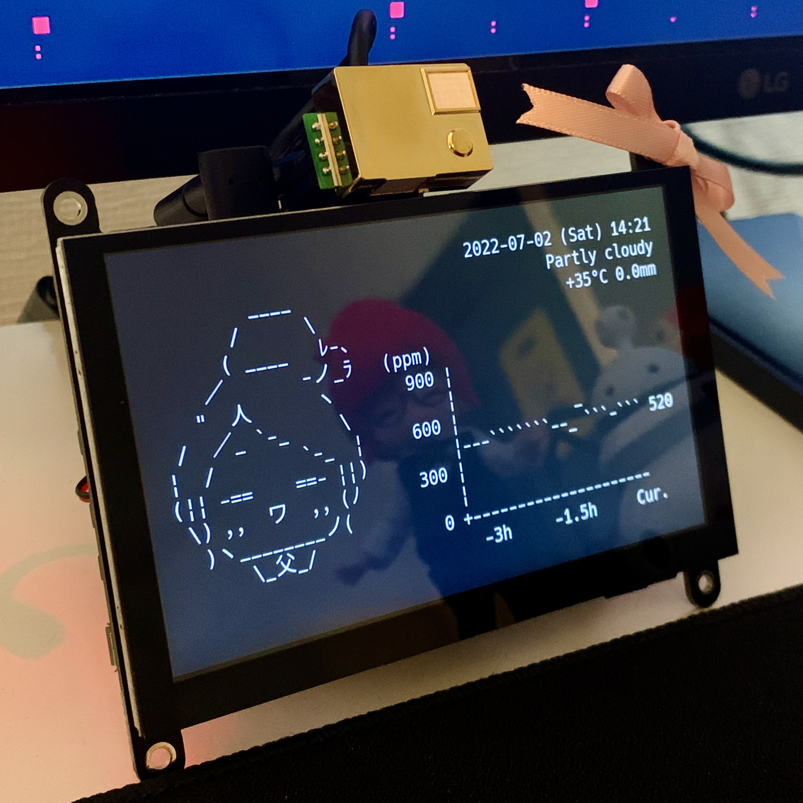

<!-- omit in toc -->
# Modane CO2 Watcher



## 1. 概要

Raspberry Pi で動作するもだねちゃんの二酸化炭素濃度計です🌸  
C 言語とラズパイの練習で制作しました。

- 周辺の CO2 濃度を10分毎に取得し、グラフとして表示します。
  - グラフは 20時間前まで、10時間前まで、3時間前まで の3つの表示を切り替えられます。
  - 取得した CO2 濃度は logs ディレクトリ内のログファイルへ蓄積されます。
- 現在の日時や天気を一定間隔毎に表示します。
  - 天気を取得する場所は環境変数で指定できます。
- もだねちゃんの表情がコロコロ変わります。
- シェルのウィンドウ幅に応じてレスポンシブに描画します。

## 2. ハードウェア

- Raspberry Pi 4 Model B
- MH-Z19B
- ELECROW RC050S

## 3. ソフトウェア

### 3.1. OS

Raspberry Pi OS (32-bit)

### 3.2. 言語

- C
  - ncurses ライブラリ
- Python
  - [mh-z19](https://github.com/UedaTakeyuki/mh-z19) モジュール

### 3.3. その他

- LXTerminal 上で実行しています。
- フォントは [HackGenNerd Console](https://github.com/yuru7/HackGen) を使用しています。

## 4. 環境構築

### 4.1. ハードウェアの構築

先に [5.1. CO2 濃度の測定](#51-co2-濃度の測定) を参考に、MH-Z19B センサーのセットアップを行います。

### 4.2. ソフトウェアの構築・実行

下記のコマンドを順に実行します。

```shell
> git clone https://github.com/kenkenpa198/ModaClock.git # リポジトリのクローン
> export WTTR_LOCALE="Tokyo"                             # 天気表示用のロケール設定
> sudo apt install libncurses5-dev                       # curses ライブラリのインストール
> sudo pip3 install mh_z19                               # mh_z19 モジュールのインストール
> gcc ModaClock.c -lncursesw -o ModaClock.out            # コンパイル
> ./ModaClock.out                                        # 実行
```

WTTR_LOCALE 環境変数は .bashrc などに記述して永続化しておいた方がよいです。  
お好みでシェルのフォントの調整や autostart 等の設定も。

## 5. 既知の不具合

- Raspberry Pi の環境でのみ、天気の初回取得後に表示がうまくできない事象が発生することがあります。
  - 次の取得時（30分毎）に正常に表示できるようになります。

## 6. クレジット

以下のソフトウェアやモジュールを利用させていただいております。

- [UedaTakeyuki/mh-z19](https://github.com/UedaTakeyuki/mh-z19)
- [chubin/wttr.in](https://github.com/chubin/wttr.in)
- [yuru7/HackGen)](https://github.com/yuru7/HackGen)

## 7. 参考サイト

### 7.1. Raspberry Pi

#### 7.1.1. セットアップ

- [ラズパイで遊ぼう！ - YouTube](https://www.youtube.com/playlist?list=PLZv220voQQ_OYkVoim13CA91R_iLospsR)
- [Raspberry Pi4で使えるタッチパネル付き5インチディスプレイを買ってみた！ – すいラボ](https://sui-lab.info/archives/3222)
- [【ラズパイ】Raspberry Piをディスプレイなしでセットアップする - 車輪日記](https://bowmiow.net/garage/raspi-first/#toc12)

#### 7.1.2. 設定

- [ラズベリーパイでフォントを簡単に追加削除する | けいきゅん ヽ(^◇^*)/♪ でおじゃる](https://ameblo.jp/anima-ameblo/entry-12398046009.html)
- [ラズパイを起動したら、ターミナル開いてシェルを実行する方法 - Qiita](https://qiita.com/tonosamart/items/f59daa481f90c85a8a99)
- [電源入れたらRaspberryPiのターミナルがGUIで全画面表示されるようにする - 知見（・・）！](https://amiq11.hatenablog.com/entry/2018/09/12/230201)
- [vim :: readonly のファイルを sudo で強制的に保存する [Tipsというかメモ]](https://tm.root-n.com/unix:command:vim:readlonly_write)
- [Raspberry Piの起動時にターミナルが立ち上がり、「Hello world」と表示される機能を実装しようと思いましたが上手くいきません.](https://teratail.com/questions/334030)
- [RasiPiでブラウザを自動起動してキオスク端末にする方法 | 映像とその周辺](https://www.kalium.net/image/2021/03/11/rasipiでブラウザを自動起動してキオスク端末にする/)

#### 7.1.3. CO2 濃度の測定

- [Raspberry Pi 4とMH-Z19Bで二酸化炭素濃度を計測してみた | DevelopersIO](https://dev.classmethod.jp/articles/raspberry-pi-4-b-mh-z19b-co2/)
- [【Python】Raspberry Pi + mh-z19でCO2濃度取得してみた - BFT名古屋 TECH BLOG](https://bftnagoya.hateblo.jp/entry/2021/08/25/120844)

### 7.2. C言語

#### 7.2.1. 画面描画

- [curses による端末制御](https://www.kushiro-ct.ac.jp/yanagawa/ex-2017/2-game/01.html)
- [cursesライブラリの超てきとー解説](https://www.kushiro-ct.ac.jp/yanagawa/pl2b-2018/curses/about.html)
- [[linux] cursesライブラリのインストール --- undefined reference 'initscr'|Debugging as Usual](http://debuggingasusual.blogspot.com/2011/12/curses.html)
- [C言語でシンプルすぎるブロック崩しを書いた - Qiita](https://qiita.com/pokohide/items/a246045f3ccaf540a375)
- [文字列の長さの取得(C言語) - 超初心者向けプログラミング入門](https://programming.pc-note.net/c/mojiretsu2.html)

#### 7.2.2. 配列操作など

- [C言語ケーススタディ　時計の作り方1](http://www.orchid.co.jp/computer/cschool/clock1.html)
- [popenでコマンドの出力を読み込む - C言語入門](https://kaworu.jpn.org/c/popenでコマンドの出力を読み込む)
- [C言語のソースからバックグラウンドでシェルを実行したい](https://teratail.com/questions/29960)
- [配列を自由自在に作る - 苦しんで覚えるC言語](https://9cguide.appspot.com/19-01.html)
- [C言語で、ファイルから一行ずつ文字列を読み込み、各行ごとに配列に格納する方法](https://detail.chiebukuro.yahoo.co.jp/qa/question_detail/q12145978347)
- [【C言語】文字列を連結・結合する【strcatの危険性とsnprintfの安全性】 | MaryCore](https://marycore.jp/prog/c-lang/concat-c-string/#snprintf関数による文字列結合)
- [【C言語】sprintf 関数と snprintf 関数（お手軽に文字列を生成する関数） | だえうホームページ](https://daeudaeu.com/c-sprintf/#sprintf-3)
- [【C言語】malloc関数（メモリの動的確保）について分かりやすく解説 | だえうホームページ](https://daeudaeu.com/c_malloc/)

### 7.3. 天気情報の取得

- [curl で wttr.in に問い合わせて ターミナル上で天気予報を確認する - ブログ](https://gouf.hatenablog.com/entry/2018/06/29/174028)
- [天気を呟くbot｜シェルスクリプトで作る Twitter bot 作成入門](https://zenn.dev/mattn/books/bb181f3f4731920f29a5/viewer/cc50c48272963c206d34)

### 7.4. アスキーアート

- [PythonとOpenCVで画像をアスキーアート化してみる（トレースAAへの道） | ねほり.com](https://nehori.com/nikki/2021/04/04/post-27881/)
- [アスキーアート - Wikipedia](https://ja.wikipedia.org/wiki/%E3%82%A2%E3%82%B9%E3%82%AD%E3%83%BC%E3%82%A2%E3%83%BC%E3%83%88)
